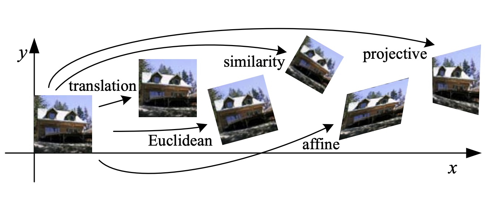

# Geometric transformations 

A geometric transform (image rotations or general warps) is a modification of the spatial relationship among pixels. 

<figure markdown>
  { width="600" }
  <figcaption>Basic set of 2D geometric image transformations (planar transformations).</figcaption>
</figure>

Image warping involves modifying the domain of an image function. We can represent the operation for obtaining the transformed image with two steps:

* Coordinate trasform: $(x',y')=T\{(x,y)\}$
* Image resampling 

## Coordinate trasform:
Points in 2D can be expressed in **homogeneous coordinates**. In this way, we can represent transformations more compactly only with matrix multiplication. From 2D point to homogeneous coordinates:

$$\begin{equation} \begin{bmatrix} x \\ y \end{bmatrix} = \begin{bmatrix} \tilde{w}x \\ \tilde{w}y \\ \tilde{w} \end{bmatrix} = \begin{bmatrix} \tilde{x} \\ \tilde{y} \\ \tilde{w} \end{bmatrix}, \end{equation}$$

From homogeneous coordinates to 2D point: 

$$\begin{equation} \begin{bmatrix} \tilde{x} \\ \tilde{y} \\ \tilde{w} \end{bmatrix} = \begin{bmatrix} \tilde{x}/\tilde{w} \\ \tilde{y}/\tilde{w} \end{bmatrix}. \end{equation}$$

### Translation in hom coords: 

* Translation: 
  
$$\begin{equation} \begin{bmatrix} x' \\ y' \end{bmatrix} = \begin{bmatrix} x \\ y \end{bmatrix} +  \begin{bmatrix} b_1 \\ b_2 \end{bmatrix}, \end{equation}$$

* Translation in hom coords: 
  
$$\begin{equation} \begin{bmatrix} x' \\ y'  \\ 1 \end{bmatrix} = \begin{bmatrix} 1 & 0 & b_1 \\ 0 & 1 & b_2 \\ 0 & 0 & 1 \end{bmatrix} \begin{bmatrix} x \\ y \\ 1 \end{bmatrix}, \end{equation}$$

* Yieldng: 
  
$$\begin{equation} \begin{bmatrix} x' \\ y'  \\ 1 \end{bmatrix} = \begin{bmatrix} 1 & 0 & b_1 \\ 0 & 1 & b_2 \\ 0 & 0 & 1 \end{bmatrix} \begin{bmatrix} x \\ y \\ 1 \end{bmatrix} = \begin{bmatrix} x+b_1\\ y+b_2\\ 1 \end{bmatrix} \end{equation}$$

### Affine transform

Is a geometric transformation that preserves point collinearity and distance ratios along a line. Affine transform can be interpreted as a linear transform followed by a translation. 

$$ \begin{equation} \begin{bmatrix} x' \\ y' \end{bmatrix} = A\begin{bmatrix} x \\ y \end{bmatrix} + \begin{bmatrix} b_1\\ b_2 \end{bmatrix}, \end{equation}$$

Homogeneous coordinates: multiple operations combined into a single matrix multiplication

$$\begin{equation} \begin{bmatrix} x' \\ y'  \\ 1 \end{bmatrix} = T\begin{bmatrix} x' \\ y'  \\ 1 \end{bmatrix}  =  \begin{bmatrix} t_{1,1} & t_{1,2} & t_{1,3} \\ t_{2,1} & t_{2,2} & t_{2,3} \\ 0 & 0 & 1 \end{bmatrix} \begin{bmatrix} x \\ y \\ 1 \end{bmatrix} \end{equation}$$

## References
 
* [image processing and computer vision by Rein van den Boomgaard](https://staff.fnwi.uva.nl/r.vandenboomgaard/IPCV20162017/LectureNotes/IP/GeometricalOperators/index.html#forward-transform)
* [Geometric Transformations of Images by OpenCV doc.](https://docs.opencv.org/3.4/da/d6e/tutorial_py_geometric_transformations.html)
